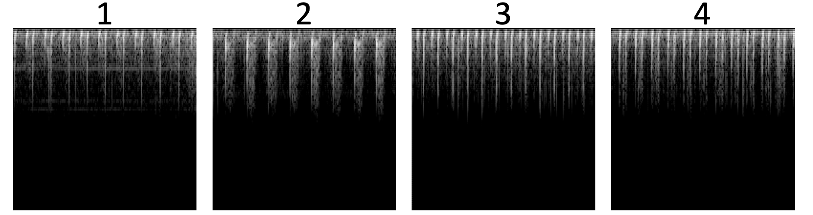

# Dataset
## Table in the paper

We use the dataset of the [PhysioNet/CinC Challenge in 2016](https://physionet.org/content/challenge-2016/1.0.0/) [1]

According to the description in the paper, the denoised audios are [here](https://github.com/zhj12399/HeartSoundSynthesis/tree/main/train-data/Audios)

|                  |    All | Normal | Abnormal |
|:----------------:|-------:|-------:|---------:|
|      Audios      |   3240 |   2575 |      665 |
| Mel Spectrograms |   6636 |   5092 |     1544 |
|  Cropped Audios  |  13015 |   9857 |     3158 |

## Training Data in Latent Diffusion Model -- Mel Spectrograms
The Mel Spectrograms are [here](https://github.com/zhj12399/HeartSoundSynthesis/tree/main/train-data/Mel)

Mel spectrograms of heart sounds from dataset

| Num |                              Sample                              |
|:---:|:----------------------------------------------------------------:|
|  1  |  |
|  2  |  |
|  3  |  |
|  4  |  |

## Training Data in Semi-Supervised Learning -- Cropped Audios
The Cropped Audios are [here](https://github.com/zhj12399/HeartSoundSynthesis/tree/main/train-data/Cropped)

The data is divided into test set and training set. 
The divided audios are [here](https://github.com/zhj12399/HeartSoundSynthesis/tree/main/train-data/Semi-Supervised).
20% of the PhysioNet dataset is divided into test sets and 80% is divided into labeled training sets.
Unlabeled data comes from the synthesis audio.

|  All  | Labeled | Test |
|:-----:|:-------:|:----:|
| 13015 |  10412  | 2603 |

> __Some Samples__ :

| Num |                                Sample                                 |
|:---:|:---------------------------------------------------------------------:|
|  1  |  |
|  2  |  |
|  3  |  |
|  4  |  |

## Reference

1. Liu C, Springer D, Li Q, Moody B, Juan RA, Chorro FJ, Castells F, Roig JM, Silva I, Johnson AE, Syed Z, Schmidt SE, Papadaniil CD, Hadjileontiadis L, Naseri H, Moukadem A, Dieterlen A, Brandt C, Tang H, Samieinasab M, Samieinasab MR, Sameni R, Mark RG, Clifford GD. An open access database for the evaluation of heart sound algorithms. Physiol Meas.2016 Dec;37(12):2181-2213