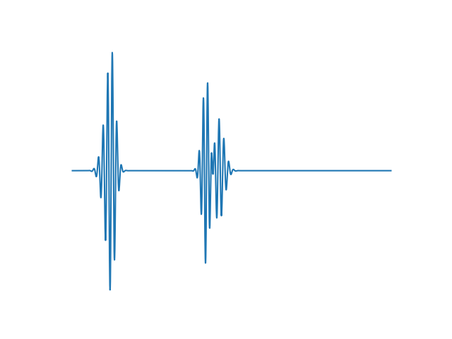

# A LATENT DIFFUSION MODEL FOR HEART SOUND SYNTHESIS

We enter the field of large-scale modelling in medical synthesis by proposing a latent diffusion model for heart sound generation, which can generate highly realistic heart sounds. We further guide the synthesis process through text prompts and labels, revealing the research field of prompted heart sound synthesis.

Heart Sound

