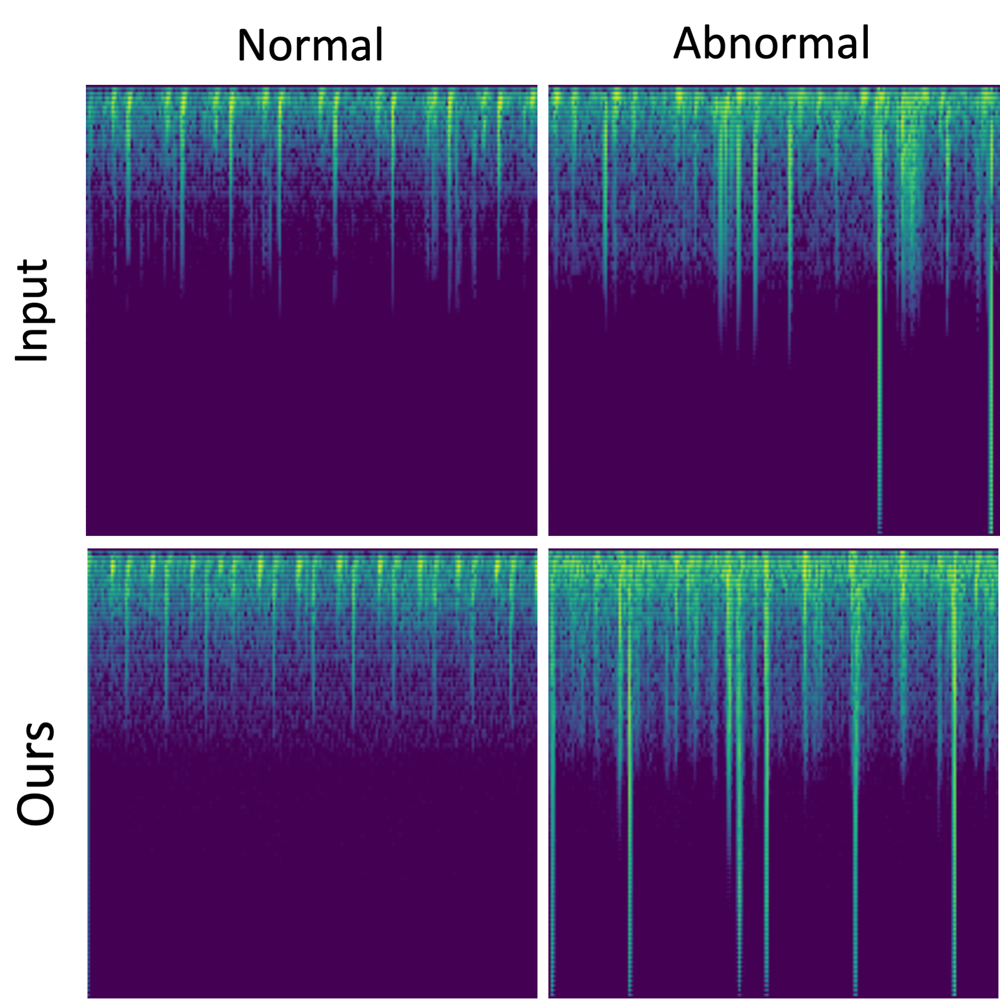

# Results

## Images used in the article

Mel spectrograms of heart sounds from the dataset and synthesised using C-LDM

## Audio Samples

> __Note that all the audio samples presented below have been downsampled to 4
time steps per beat (originally 24 time steps per beat).__

### Best samples



### Generation from scratch

> No cherry-picking. Some might sound unpleasant. __Lower the volume first!__

| Num | Sample                                                               |
|:---:|:--------------------------------------------------------------------:|
|  1  |  |
|  2  |   |
|  3  |    |

### Track-conditional generation

> No cherry-picking. Some might sound unpleasant. __Lower the volume first!__

| Num | Sample                                                                    |
|:---:|:-------------------------------------------------------------------------:|
|  1  |  |
|  2  |   |
|  3  |    |
